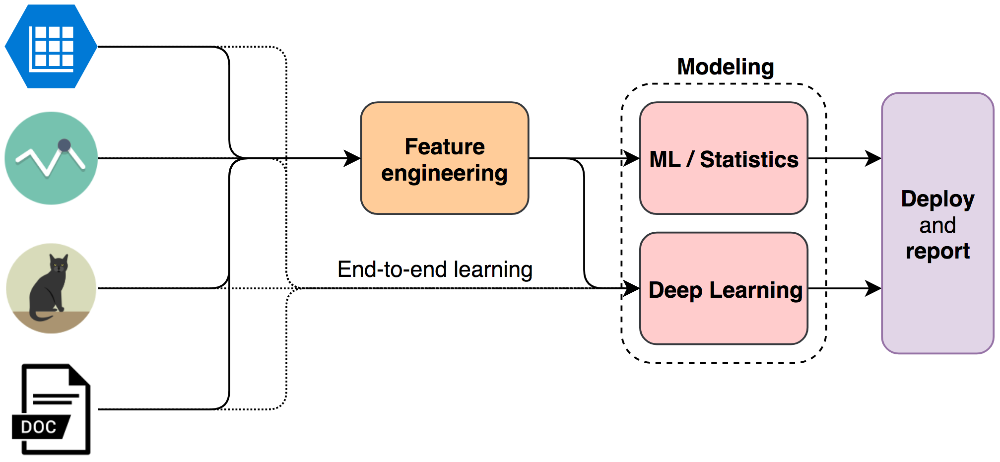

# Data Science Ephemeralization

## TLDR

The solution lies in the problem:

- The data will tell you how to do feature engineering.
- The problem will tell you which metrics to use, choose one and stick with it.
- Nobody will tell you which model to use, build a basic one as fast as you can and move from there.

## Introduction

> "To think is to forget differences, generalize, make abstractions." - Borges

The deluge of techniques in Data Science can can cause some ~~despair~~ dizziness. Nonetheless, **most** of the problems we face as practitioners of the craft boil down to some basic concepts and rules of thumb. Buckminster Fuller coined the term ephemeralization to describe the ability to do *"more and more with less and less until eventually you can do everything with nothing"*. This repository is a trial in devising a minimilistic mental framework for dealing with a wide range of problems in Data Science.

The four basic concerns of the data scientist are data wrangling, feature engineering, modeling and reporting results. Let's focus our attention on the central ones: feature
engineering and modeling. I will not dive into the tools you we use to accomplish these tasks, but some basic cloud
infraestructure knowledge, [version control](https://git-scm.com/), [ssh](https://en.wikipedia.org/wiki/Secure_Shell), and a [programming language](https://www.python.org/)
can get us pretty far.

The data scientist's work is **data-centric**, it all starts and revolves around data. Our job is choosing the paths along the above flowchart,
but we already know where to start: **look at the data type**. The majority of problems deal with one of 4 data types: **tables**; **time series**; **images** and **text**.
Each data type has its own gamut of suitable feature engineering techniques. The feature engineering is the process of creating the best process representation with the available data.

## Feature engineering

Finding the best representation for a process is a hard task, but it usually comes down to highlighting informative relations and removing noise. Besides, the feature engineering process has a clear target: turning the raw data into a
 **numeric table without missing values**. That's it! Other concept to keep in mind is that of [end-to-end learning](https://www.youtube.com/watch?v=ImUoubi_t7s). Some deep learning models are able to make good data representations themselves, killing two birds with
one stone: feature engineering and modeling.

### Table

The table is the most common data structure in data science. Even when you are working with the other data type you may have a data table at the end.

- Missing values.
- Handling outliers.
- Categorical encoding.
- Dimensionality reduction.
    - Feature selection.
        - Filter.
        - Wrapper.
        - Embedded.
    - Feature extraction.
        - PCA.
        - t-SNE.
        - Autoencoder.

### Text

Five steps:

- Cleaning.
- Tokenization.
- Remove stop words.
- Stemming or lemmatization.
- Encoding:
    - Bag-of-words.
    - Tf-idf.
    - Word embedding.

### Time series

All time series models deal with autocorrelation in some way. The process of transforming the time series into a table revolves around creating the 
following feature types:

- Date-time features.
- Lag features.
- Window features: 
    - Rolling window statistics.
    - Expanding window statistcs.

Missing values imputation:
- Last Observation Carried Forward (LOCF).
- Next Observation Carried Backward (NOCB).
- Linear interpolation.
- Seasonal Adjustment + Linear Interpolation.

### Image

*To do*.

## Modeling

> "All model are wrong, but some are useful." - George Box

Before exploring the models, let's define our metric. Almost certainly, the project will fall into one of two categories: classification or regression. There are many
[metrics](https://scikit-learn.org/stable/modules/model_evaluation.html) to choose from, but the usual suspects are:

- **Classification**
    - Binary: [recall](https://en.wikipedia.org/wiki/Precision_and_recall); [precision](https://en.wikipedia.org/wiki/Precision_and_recall); [F1-Score](https://en.wikipedia.org/wiki/F1_score); [AUC](https://en.wikipedia.org/wiki/Receiver_operating_characteristic).
    - Multilabel: micro and macro averaging of the above-mentioned metrics. Other approach is transforming the multilabel into a binary problem (one-vs-all or one-vs-one). 
- **Regression**: some sort of agreggation around the error, like [MAE](https://en.wikipedia.org/wiki/Mean_absolute_error) or [RMSE](https://en.wikipedia.org/wiki/Root-mean-square_deviation).

One last point about it, unless it's strictly necessary, **do not change the evaluation metric during the project**. So far, so good: the data guided the feature engineering process, the problem told me which metric I should use. What about the model? Bad news, there is no right model. The silver lining is that we are not looking for the right model, we are looking for a useful one.

Choosing the model for a phenomenom is like opening a [Pandora's box](https://leandromineti.github.io/ml-knowledge-graph/). The rule of thumb here is: start with the basics and move from there. Linear and logistic regression are two good starting candidates. While assessing many different models, and [combinations of them](https://mlwave.com/kaggle-ensembling-guide/), keep two concepts in mind:

- **Interpretation or acuracy?**: if you need to explain the predictions of your model, you may want to avoid the more complex ones. 
- **Computational resources**: the hardware available for development and deployment will set some limits on the models you should try.

Now we are good to go. **Where is the data?**
