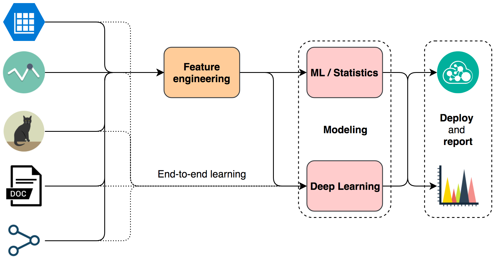
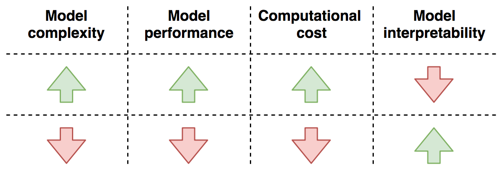

# Data Science Ephemeralization

## TLDR

The solution lies in the problem:

- The data will tell you how to do feature engineering.
- The response variable will tell you which metrics to use, choose one and stick with it.
- Nobody will tell you which model to use, build a basic one as fast as you can and move from there.

## Introduction

> "To think is to forget differences, generalize, make abstractions." - Borges

The deluge of techniques in Data Science can can cause some ~~despair~~ dizziness. Nonetheless, **most** of the problems we face as practitioners of the craft boil down to some basic concepts and rules of thumb. Buckminster Fuller coined the term ephemeralization to describe the ability to do *"more and more with less and less until eventually you can do everything with nothing"*. This repository is a trial in devising a minimilistic mental framework for dealing with a wide range of problems in Data Science.

The four basic concerns of the data scientist are data wrangling, feature engineering, modeling and reporting results. Let's focus our attention on the central ones: feature
engineering and modeling. I will not dive into the tools you we use to accomplish these tasks, but some basic cloud
infraestructure knowledge, [version control](https://git-scm.com/), [ssh](https://en.wikipedia.org/wiki/Secure_Shell), and a [programming language](https://www.python.org/)
can get us pretty far.

The data scientist's work is **data-centric**, it all starts and revolves around data. Our job is choosing the paths along the above flowchart,
but we already know where to start: **look at the data type**. The majority of problems deal with one of 5 data types: **tables**; **time series**; **images**;**text** and **graphs**.
Each data type has its own gamut of suitable feature engineering techniques. The feature engineering is the process of creating the best process representation with the available data.

## Feature engineering

Finding the best representation for a process is a hard task, but it usually comes down to highlighting informative relations and removing noise. Besides, the feature engineering process has a clear target: turning the raw data into a
 **numeric table without missing values**. That's it! Other concept to keep in mind is that of [end-to-end learning](https://www.youtube.com/watch?v=ImUoubi_t7s). Some deep learning models are able to make good data representations themselves, killing two birds with
one stone: feature engineering and modeling. Now, let's check out some techniques:

### Table

The table is the most common data structure in data science. Even when you are working with the other data type you may have a data table at the end. Your 4 main concerns are:

- **Missing values**: when facing missing values you can either delete them, and lose information, or impute them **carefully**!
    - Deletion:
        - Listwise.
        - Pairwise.
        - Columns.
    - Imputation:
        - Categorical: mode; use NA as a level; logistic or multinomial regression with other variables; multiple imputation.
        - Continuous: mean, median, mode; regression; multiple imputation.
- **Outliers**.
- **Categorical encoding**: depends on the number of categories present in a variable (*cardinality*):
    - Low cardinality: one-hot encoding.
    - High cardinality: hashing; bucketing; embeddings.
    - Ciclic variables: circular encoding.
- **Dimensionality reduction**:
    - Feature selection:
        - Filter: based on the statistical properties of each available feature and its relation to the response variable.
        - Wrapper: based on the statistical properties of feature subsets and its relation to the response variable.
        - Embedded: features are selected by some form of the regularization on the model, e.g. [LASSO](https://en.wikipedia.org/wiki/Lasso_(statistics)).
    - Feature extraction:
        - Linear: [PCA](https://en.wikipedia.org/wiki/Principal_component_analysis).
        - Non-linear: [t-SNE](https://en.wikipedia.org/wiki/T-distributed_stochastic_neighbor_embedding); [UMAP](https://arxiv.org/abs/1802.03426); [autoencoder](https://en.wikipedia.org/wiki/Autoencoder).

### Text

The feature engineering on text is usually done in five steps:

- **Cleaning**: removing unused characters, spaces and punctuation.
- **Tokenization**: separate the text into information units, usually words.
- **Remove stop words**: remove frequent and usuless words.
- **Stemming** or **lemmatization**: both aim to reduce inflexional forms. In other words, they try to reduce words to its morphological root.
- **Encoding**: after the aforementioned steps you have a list of words. The enconding is where you transform it into a data table.
    - [Bag-of-words](https://en.wikipedia.org/wiki/Bag-of-words_model).
    - [Tf-idf](https://en.wikipedia.org/wiki/Tf%E2%80%93idf).
    - [Word embedding](https://en.wikipedia.org/wiki/Word_embedding).

After this process you will have a data table. Now you can still apply all those techniques used on tables.

### Time series

With time series you have two concerns: missing values and creating features to represent the series as a table:

- **Missing values**: contraty to tables, deletion is not really an option here. Besides, imputation here has some particularities:
    - Last Observation Carried Forward (LOCF).
    - Next Observation Carried Backward (NOCB).
    - Linear interpolation.
    - Seasonal Adjustment + Linear Interpolation.
- **Encoding**:
    - Lag features: all time series models deal with autocorrelation in some way. 
    - Date-time features.
    - Window features:
        - Rolling window statistics.
        - Expanding window statistcs.

Again, having a data table at the end, you can still apply all those techniques used on tables.

### Image

*To do*.

### Graph

> *To do*.

###

## Modeling

> "All model are wrong, but some are useful." - George Box

Choosing the model for a phenomenom is like opening a [Pandora's box](https://leandromineti.github.io/ml-knowledge-graph/). The rule of thumb here is: start with the basics and move from there. Linear and logistic regression are two good starting candidates. While assessing many different models, and [combinations of them](https://mlwave.com/kaggle-ensembling-guide/), keep 4 things in mind: **model complexity**; **model perfomance**; **computational cost** and **model interpretability**.

The relationship between the above concepts can be very complicated. As a rule of thumb: when the model complexity increases, the model performance and computational cost increase, and the model interpretability decreases; when the model complexity decreases, the model performance and computational cost decrease, and the interpretability increases.

If feature engineering is all about data types, modeling is all about the response variable. Most projects will fall into one of two categories: if the response variable is a scalar, you have **regression** problem, if it is a category, you have a **classification** problem. The first step when modeling is defining your metric, and the response variable will guide you here. There are many [metrics](https://scikit-learn.org/stable/modules/model_evaluation.html) to choose from, but the usual suspects are:

- **Classification**
    - Binary: [recall](https://en.wikipedia.org/wiki/Precision_and_recall); [precision](https://en.wikipedia.org/wiki/Precision_and_recall); [F1-Score](https://en.wikipedia.org/wiki/F1_score); [AUC](https://en.wikipedia.org/wiki/Receiver_operating_characteristic).
    - Multilabel: micro and macro averaging of the above-mentioned metrics. Other approach is transforming the multilabel into a binary problem (one-vs-all or one-vs-one). 
- **Regression**: some sort of agreggation around the error, like [MAE](https://en.wikipedia.org/wiki/Mean_absolute_error) or [RMSE](https://en.wikipedia.org/wiki/Root-mean-square_deviation).

One last point evaluation metrics, unless it's strictly necessary, **do not change the evaluation metric during the project**. So far, so good: the data guided the feature engineering process, the response variable told me which metric I should use. What about the model? Bad news, there is no right model. The silver lining is that we are not looking for the right model, we are looking for a useful one. We will consider a model to be useful when it has the best possible predictive
power.

### Model complexity and performance

> *To do*

When assessing model perfomance, explore: **overfitting/underfitting** and **data availabitility**.

### Model complexity and computational resources

> *To do*

The computational resources are key in two different steps of modeling: **training** and **deployment**.

### Model complexity and interpretation

> "Explanations exist; they have existed for all time; there is always a well-known solution to every human problem — neat, plausible, and wrong." - H. L. Mencken.

> *To do*

The interpretation of models can follow two paths: **direct assessment of model parameters** or **secondary assessment**.

One last caveat about explanations, a model will always be a simplification of reality. This
simplification is both the power and weakness of models. When interrogating your model for 
explanations, remember you get information about what the model 'understands' of the phenomenon, not the phenomenon itself. Keep this in mind to avoid overarching conclusions based
on shaky premises: *the treachery of models*.

### Final remarks

As ~~data~~ scientists, we have an Aristotelian urge to classify stuff. If 
that is your thing, good news! There are a lot of labels you can attach to 
modeling techniques: generative, discriminative, parametric, nonparametric, 
semiparametric, bayesian *et al*. When choosing your path here, remember Vapnik's advice favoring discriminative models: "*when solving a problem of interest, do not solve a more general problem as an intermediate step.*".

The choice between the parametric and nonparametric will be based on 
your need for interpretability; model performance and/or available
hardware. Technicalities aside, the golden rule in modeling is: **build a basic model as fast as you can and move from there**. You can only improve what you already have! Furthermore, the usual experience from data scientists is that the [Pareto principle](https://simplystatistics.org/2014/03/20/the-8020-rule-of-statistical-methods-development/) applies here: you can achieve 80% of the final results with 20% of the effort.

Now we are good to go. **Where is the data?**

## References

- Albon, C. (2018). Machine learning with Python cookbook: practical solutions from preprocessing to deep learning (First edition). Sebastopol, CA: O’Reilly Media.
- Kuhn, M., & Johnson, K. (2013). Applied predictive modeling (Vol. 26). New York: Springer.
- Swalin, A. (2018, January 31). How to Handle Missing Data. Retrieved December 15, 2018, from https://towardsdatascience.com/how-to-handle-missing-data-8646b18db0d4
- Zheng, A., & Casari, A. (2018). Feature engineering for machine learning: principles and techniques for data scientists (First edition). Beijing : Boston: O’Reilly.
- "The Treachery of Models" adapted from Magritte, René. "The Treachery of Images." Oil on canvas 231, no. 2 (1928): 1928-29.
- **Cover image**: adapted from Herbert Matter | Buckminster Fuller | 1970 | Edward Cella. (n.d.). Retrieved December 15, 2018, from https://edwardcella.com/exhibition/153/exhibition_works/3597
